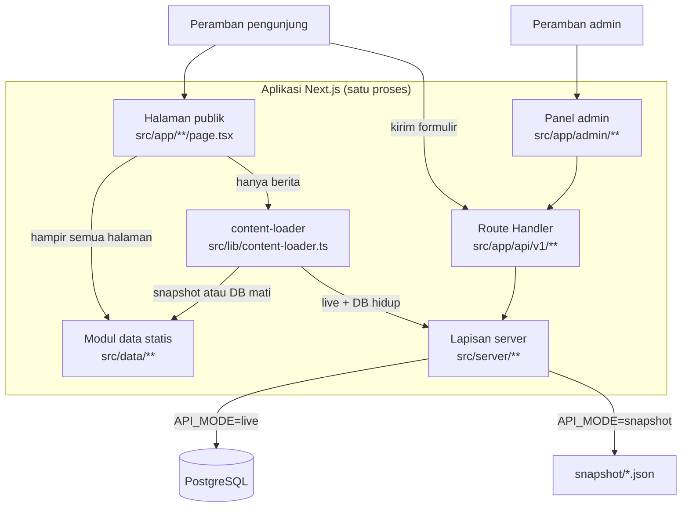
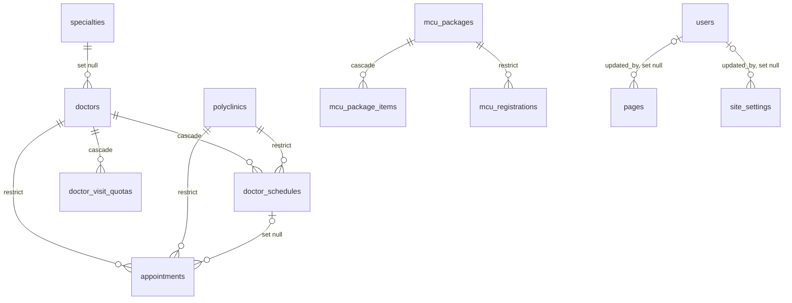

# Arsitektur

Dokumen ini menjelaskan **bagaimana data mengalir** di Web-Kesehatan dan **mengapa**
bentuknya begini. Ditulis dari kode pada commit `4d848c3` (9 Oktober 2026),
diselaraskan ke `f1ebe60` (10 Oktober 2026); bagian yang tidak
bisa diverifikasi ditandai **BELUM DIVERIFIKASI**. Perubahan di antara dua
commit itu (docs, uji, CI, a11y, prefetch, skrip bantu) tidak mengubah alur
data, endpoint, skema, atau mode, jadi diagram dan ERD tetap berlaku.

Aturan dokumen: fakta yang punya satu sumber ditautkan, bukan disalin.
Status fitur ada di [`HANDOFF.md`](HANDOFF.md), [`STATUS-PROYEK.md`](STATUS-PROYEK.md), dan [`roadmap.md`](roadmap.md),
hasil audit di [`AUDIT-KEAMANAN.md`](AUDIT-KEAMANAN.md),
daftar endpoint di [`API.md`](API.md), cara menguji di [`TESTING.md`](TESTING.md),
cara rilis di [`DEPLOYMENT.md`](DEPLOYMENT.md) (yang menautkan
[`DEPLOY-VERCEL.md`](DEPLOY-VERCEL.md) dan [`DEPLOY-VPS.md`](DEPLOY-VPS.md)).

---

## 1. Gambaran besar

Satu aplikasi Next.js 16 (App Router) melayani tiga hal sekaligus:

1. **Halaman publik** (`src/app/**/page.tsx`): beranda, pelayanan, berita, jadwal dokter, formulir.
2. **API** (`src/app/api/v1/**/route.ts`): Route Handler untuk formulir, data publik, dan panel admin.
3. **Panel admin** (`src/app/admin/**`): login, dasbor, inbox, manajemen data, akun.

Tidak ada backend terpisah. Backend Rust yang lama diarsipkan di
`archive/rust-api/` (read-only) dan tidak dipakai lagi.



---

## 2. Mengapa halaman publik membaca `src/data/`, bukan API

Ini keputusan yang disengaja, jangan "diperbaiki" tanpa persetujuan pemilik repo.

- **Situs tidak boleh kosong saat database mati.** Halaman publik membaca modul
  TypeScript di `src/data/`, jadi isinya tetap tampil walau PostgreSQL tidak terjangkau.
- **Isi seed database lebih tipis daripada isi modul statis.** Menurut
  [`roadmap.md`](roadmap.md) bagian 3.17, seed punya 17 dokter dan 5 poliklinik,
  sedangkan modul statis punya 30+ dokter dan 25 poliklinik. Menyalakan
  database untuk halaman-halaman itu akan membuat situs lebih tipis, bukan lebih hidup.
- **Pengecualian: berita.** Acceptance Criteria butir 9 meminta perubahan admin
  tampil di situs publik, jadi `/berita`, `/berita/[slug]`, beranda, dan
  `sitemap.xml` membaca lewat `src/lib/content-loader.ts`.

Urutan sumber berita di `content-loader`:

| Kondisi | Sumber |
| --- | --- |
| `API_MODE=live` dan database hidup dan tabel `articles` berisi | Tabel `articles` |
| `API_MODE=snapshot` | Modul statis (`ARTICLES` di `src/data/home.ts`) |
| `API_MODE=live` tetapi database tidak terjangkau atau kueri gagal | Modul statis, dengan peringatan di log |
| Database hidup tetapi `articles` kosong | Modul statis (dianggap "belum diisi") |

Aturan menambah sumber data baru: tambahkan ke `getPublicArticles()` /
`getPublicArticle()` (atau fungsi serupa di `content-loader.ts`), **jangan**
menulis pembacaan database langsung di page component.

Halaman berita memakai `revalidate` (60 detik; sitemap satu jam) supaya perubahan
admin tampil tanpa build ulang. `dynamicParams` di `/berita/[slug]` harus tetap
`true` agar slug yang baru dibuat admin tidak 404.

---

## 3. `API_MODE`: `live` vs `snapshot`

Dibaca oleh `src/server/config.ts` (satu kali, di-cache). **`API_MODE` yang
menentukan mode, bukan isi `DATABASE_URL`.**

| | `live` (bawaan) | `snapshot` |
| --- | --- | --- |
| `DATABASE_URL` | Wajib. Kosong → server berhenti dengan `ConfigError` | Boleh kosong |
| `AUTH_SECRET` | Wajib, minimal 32 karakter | Tidak ditegakkan |
| Endpoint baca publik | Kueri ke PostgreSQL | Baca `snapshot/*.json` |
| Endpoint tulis (formulir, admin) | Jalan | Ditolak `503 READ_ONLY_MODE` |
| Login admin | Jalan | Ditolak 503, jadi tidak ada token sesi yang bisa terbit |
| `GET /api/v1/health` | Cek koneksi DB | Tetap 200 dengan `database: "tidak terhubung"` |
| Dipakai untuk | VPS produksi, pengembangan lokal dengan Docker | Pratinjau Vercel, CI, build tanpa database |

Dasar perilaku ini: `dbOrNull()` di `src/server/db/client.ts` mengembalikan `null`
di mode snapshot, dan setiap pemanggil **wajib** menangani cabang `null`
(biasanya `throw ApiError.readOnly()`).

> **Perhatian:** komentar di `.env.example` lama menyebut "DATABASE_URL kosong
> berarti mode snapshot". Itu tidak benar menurut `config.ts`: tanpa
> `API_MODE=snapshot`, `DATABASE_URL` kosong membuat server **gagal start**.
> Komentar itu sudah dikoreksi di perubahan yang menyertai dokumen ini.

### Cara kerja snapshot

- `snapshot/manifest.json` memetakan path API ke nama berkas; satu berkas per path,
  `/` diganti `__` (mis. `doctors__<uuid>__schedules.json`).
- `denganSnapshot()` di `src/server/api/snapshot.ts` memilih: DB tersedia → kueri,
  DB `null` → baca berkas. Bentuk isi berkas sama dengan balasan API (amplop `data`).
- `next.config.ts` memuat `outputFileTracingIncludes` untuk `/api/v1/**` supaya
  `snapshot/**` ikut ke hasil build. Tanpa itu, mode snapshot di Vercel diam-diam menjawab 404.
- Dibuat ulang dengan `bun run db:snapshot` (butuh database hidup). Diff-nya
  besar karena beberapa field berubah tiap pembuatan; lihat `snapshot/README.md`.
- Snapshot tidak bisa menjawab filter (`?specialty=`, `?category=`, `?type=`),
  halaman kedua, jadwal per tanggal, dan kapasitas bed yang akurat. Karena itu
  mode snapshot hanya untuk menampilkan, bukan menerima kiriman.

---

## 4. Alur sebuah permintaan

### 4.1 Formulir publik (`POST`)

Enam endpoint formulir (`appointments`, `admissions`, `mcu-registrations`,
`feedbacks`, `survey-responses`, `wbs-reports`) memakai kerangka yang sama,
`jalankanForm()` di `src/server/api/form.ts` (komentar di berkas itu masih
menyebut "lima"; jumlah sebenarnya enam sejak endpoint rawat inap ditambah). **Urutannya penting**:

1. `limitRequest` (rate limit per IP per endpoint)
2. `readJsonBody` (batas ukuran `BODY_LIMIT_BYTES`)
3. Honeypot (`website` terisi → balas kode tiket palsu, bukan 400)
4. `dbOrNull()` → `null` berarti `503 READ_ONLY_MODE`
5. Validasi (`src/server/validation.ts`, semua galat dikumpulkan lalu dilempar sekaligus, `422`)
6. Tulis ke database (`src/server/db/repo/*`)
7. `resetLimit` hanya setelah tulis berhasil

Respons sukses `201 { "data": {...} }`; galat `{ "error": { code, message, fields? } }`.
Kode galat ada di `src/server/api/error.ts`.

### 4.2 Pendaftaran rawat jalan

`POST /api/v1/appointments` butuh `schedule_id` (UUID jadwal dokter). Alur UI di
`src/components/forms/registration-form.tsx`: pilih dokter (`GET /doctors`) →
pilih slot (`GET /schedules`) → kirim. NIK divalidasi formatnya tetapi **tidak
disimpan** (diganti angka nol sebelum INSERT). Pendaftaran ganda ditolak oleh
unique index `(phone, schedule_id)` (`drizzle/0003_anti_ganda.sql`).

### 4.3 Panel admin

- Gerbang halaman: `src/app/admin/(panel)/layout.tsx` memanggil `readSession()` lalu
  `redirect("/admin/login")`.
- Gerbang API: semua route di `src/app/api/v1/admin/**` memanggil `requireSession()`;
  route yang mengubah konten juga `canEditContent`, route akun `canManageUsers`.
- Sesi: cookie `rsud_session` (HttpOnly, SameSite=Lax, `Secure` bila
  `ADMIN_ORIGIN` diawali `https://`), ditandatangani HMAC-SHA256. Setiap
  permintaan admin memeriksa `session_version` dan `is_active` ke database, jadi
  pencabutan berlaku seketika. Detail ada di [`../SECURITY.md`](../SECURITY.md).
- Peran: `super_admin`, `editor`, `front_office` (enum `user_role`).
- CRUD generik: `src/server/admin/registry.ts` mendeskripsikan 17 tabel yang
  bisa dikelola; `RecordManager` merakit layar dari deskripsi itu.
- Halaman panel: login, dasbor (termasuk pendaftaran harian dan survei per unit), akun, beds, inbox, records, pengaturan (7 `page.tsx`).
- Inbox: enam jenis (`appointments`, `admissions`, `mcu-registrations`,
  `feedbacks`, `wbs-reports`, `survey-responses`) di `src/server/admin/inbox.ts`.

### 4.4 Cek status tiket

`GET /api/v1/tickets/{kind}/{code}`: rate limit, validasi bentuk kode, lalu satu
baris dengan **empat kolom saja** (kode, status, dibuat, diubah). Awalan kode tiket:
`EP` (rawat jalan), `RI` (rawat inap), `MCU`, `KS` (kritik-saran), `WBS`, `SKM`.

---

## 5. Peta folder

```
.
├── src/
│   ├── app/
│   │   ├── [...slug]/       halaman generik; rutenya dari collectNavPaths()
│   │   ├── admin/           login + panel (route group "(panel)")
│   │   ├── api/v1/          Route Handler + catcher 404 di [...path]
│   │   └── <rute>/          halaman bernama (berita, daftar-online, ...)
│   ├── components/          komponen per bagian (admin, forms, home, layout, ...)
│   ├── data/                konten statis TypeScript (sumber halaman publik)
│   ├── lib/                 fungsi murni: format, nav-path, sitemap, content-loader,
│   │                        validasi-umum (aturan surel/telepon dipakai klien dan server)
│   ├── server/
│   │   ├── config.ts        satu-satunya pembaca environment
│   │   ├── api/             respond, error, form, rate-limit, snapshot
│   │   ├── auth/            password (scrypt), session (HMAC)
│   │   ├── admin/           accounts, inbox, records, registry, stats
│   │   ├── db/              client, schema, repo/*
│   │   ├── validation.ts    validator + Errors
│   │   ├── markdown.ts      sanitasi Markdown (allow-list)
│   │   └── ticket.ts        pembuat kode tiket
│   └── styles/              tokens, site, home, pages, admin (+ subset Bootstrap)
├── drizzle/                 migrasi SQL + meta (jurnal)
├── snapshot/                salinan baca endpoint publik (JSON)
├── scripts/                 seed, snapshot, backup-db, kunci-build, uji-performa, gerbang pemeriksaan (cek:*, audit:*)
├── tests/                   unit test Vitest
├── e2e/                     tes end-to-end Playwright (publik, a11y, alur-db)
├── docs/                    PRD, roadmap, token desain, dokumen ini
├── archive/                 legacy-v1 dan rust-api (read-only, dikecualikan ESLint)
├── Dockerfile, .dockerignore   image produksi (VPS)
└── .github/workflows/       gerbang.yml (CI) dan e2e-db.yml (E2E ber-database)
```

### Sumber kebenaran rute

`collectNavPaths()` (`src/lib/nav-path.ts`) menelusuri `NAV_ITEMS`,
`HEADER_CTAS`, dan `FOOTER_LINKS` di `src/data/navigation.ts` untuk membuat
halaman generik. Tautan yang tidak ada di salah satu dari tiga array itu **404**.
`src/app/[...slug]/page.tsx` memakai `dynamicParams = false` supaya URL asing
menjawab 404 sungguhan. Sitemap memindai folder `src/app` lewat
`collectSitemapPaths()` (`src/lib/sitemap.ts`).

### Styling

Bootstrap 5.3.3 (bukan Tailwind). Urutan import di `src/app/layout.tsx`
penting: `bootstrap.min.css` → `bootstrap-icons` → `tokens.css` → `site.css` →
`pages.css`; `home.css` hanya diimpor `src/app/page.tsx`. Angka desain diukur
dari situs rujukan: lihat `design-tokens-terverifikasi.md`.

---

## 6. Database

PostgreSQL 17 (lokal via `docker-compose.yml`, `postgres:17-alpine`), akses
lewat Drizzle ORM + driver `postgres`. Skema di `src/server/db/schema.ts`.

**28 tabel** (diverifikasi: 27 `CREATE TABLE` di `drizzle/0000_baseline.sql` + 1 di
`drizzle/0004_slimy_vector.sql`; 28 `pgTable(` di `schema.ts`). Migrasi `0005`
tidak menambah tabel.

| Kelompok | Tabel |
| --- | --- |
| Pengguna | `users` |
| Klinik dan dokter | `polyclinics`, `specialties`, `doctors`, `doctor_schedules`, `doctor_visit_quotas` |
| Layanan dan MCU | `services`, `mcu_packages`, `mcu_package_items` |
| Konten | `articles`, `pages`, `management_members`, `documents`, `hero_slides`, `awards`, `gallery_items`, `testimonials`, `insurance_partners`, `faqs`, `job_vacancies`, `site_settings` |
| Transaksi pengunjung | `appointments`, `admissions`, `mcu_registrations`, `feedbacks`, `wbs_reports`, `survey_responses` |
| Operasional | `bed_capacity` |

### ERD (hanya relasi foreign key)

Relasi di bawah diekstrak dari `.references(...)` di `schema.ts`. Kolom tidak
digambar; lihat `schema.ts` untuk daftar lengkapnya. Tabel yang tidak muncul
tidak punya foreign key.



Arti label: aksi `ON DELETE` pada foreign key. `restrict` menolak penghapusan
induk yang masih punya anak; `cascade` ikut menghapus anak; `set null`
mengosongkan kolom rujukan.

### Migrasi

| Berkas | Isi |
| --- | --- |
| `0000_baseline.sql` | 27 tabel + enum (baseline dari backend Rust) |
| `0001_set_updated_at.sql` | trigger `set_updated_at` |
| `0002_session_version.sql` | kolom `users.session_version` (pencabutan sesi) |
| `0003_anti_ganda.sql` | unique index `appointments(phone, schedule_id)` |
| `0004_slimy_vector.sql` | tabel `admissions` (+ enum `admission_status`, `ward_class`) |
| `0005_slug_paket_mcu.sql` | migrasi data: menyamakan slug `mcu_packages` dengan slug halaman paket (tiga baris dipindah, tiga baris ditambah); tidak menambah tabel |

Dijalankan dengan `bun run db:migrate` (`drizzle-kit migrate`). Tidak ada migrasi
"turun" (down); lihat [`DEPLOYMENT.md`](DEPLOYMENT.md) bagian rollback.

### Aturan data penting

- Uang disimpan `numeric(12,2)` dalam mode `number`, bukan `float`.
- Tabel runtime (`appointments`, `doctor_visit_quotas`, `feedbacks`,
  `mcu_registrations`, `survey_responses`, `wbs_reports`) tidak ikut di-seed
  (`TABEL_RUNTIME` di `scripts/seed-data.ts`). **BELUM DIVERIFIKASI** apakah
  `admissions` juga masuk daftar itu: daftar di kode saya baca hanya sampai enam butir pertama.
- Nama tabel dari URL (`/admin/records/[table]`, `/admin/inbox/[kind]`) hanya
  diterima lewat daftar putih (`registry.ts`, `KINDS` di `inbox.ts`) karena
  masuk ke SQL tanpa tanda kutip.

---

## 7. Konfigurasi runtime

Semua dibaca di `src/server/config.ts`; daftar variabel dan bawaannya ada di
`.env.example`. Dua yang paling sering salah:

- `ADMIN_ORIGIN` menentukan atribut `Secure` pada cookie sesi. Di mode `live`
  nilai `http://` untuk host selain loopback ditolak saat start (`ConfigError`).
- `NEXT_PUBLIC_SITE_URL` dibaca saat **build** (`metadataBase`, sitemap, Open
  Graph); mengubahnya setelah build tidak berpengaruh.

Header keamanan (CSP, HSTS, `X-Content-Type-Options`, `Referrer-Policy`, `Permissions-Policy`, `X-Frame-Options`) didefinisikan statis di `next.config.ts` lewat `headers()` untuk semua respons; CSP masih memakai `'unsafe-inline'` pada `script-src` dan `style-src` (keputusan terdokumentasi di `AUDIT-KEAMANAN.md`: nonce butuh middleware dan mengubah halaman statis menjadi dinamis). Tidak ada `middleware.ts`/`proxy.ts`, disengaja.

Rate limit memakai `Map` di memori proses (`globalThis`), jadi **tidak dibagi
antar instance**. Di VPS satu proses ini cukup; di platform serverless setiap
instance punya penghitung sendiri (alasan Vercel hanya dipakai untuk pratinjau snapshot).

---

## 8. Jebakan yang pernah jadi bug

Dipindahkan ringkas dari `AGENTS.md`; rujukan lengkapnya di sana.

- `params` di Next.js 16 adalah `Promise`: `const { slug } = await params`.
- `generateStaticParams` untuk catch-all harus mengembalikan `{ slug: string[] }[]`.
- Aturan `.photo-box` harus di `site.css`, bukan `home.css`.
- Jangan menulis `*/` di dalam komentar blok apa pun.
- `suppressHydrationWarning` pada `<html>`/`<body>` disengaja (ekstensi peramban
  menyuntik atribut). Galat hydration di `/daftar-online` yang berasal dari
  ekstensi bukan bug kode.
- Build memakai `next/font/google` (Poppins) dan **butuh akses internet ke
  fonts.googleapis.com** saat `bun run build`. Lihat [`DEPLOYMENT.md`](DEPLOYMENT.md).
