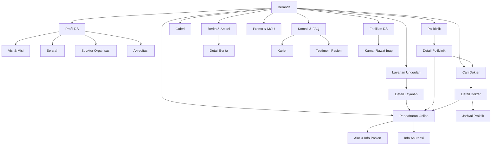
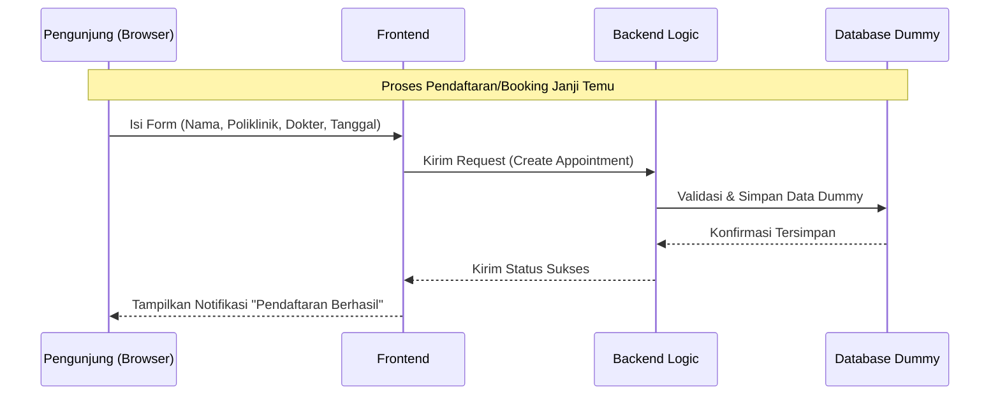
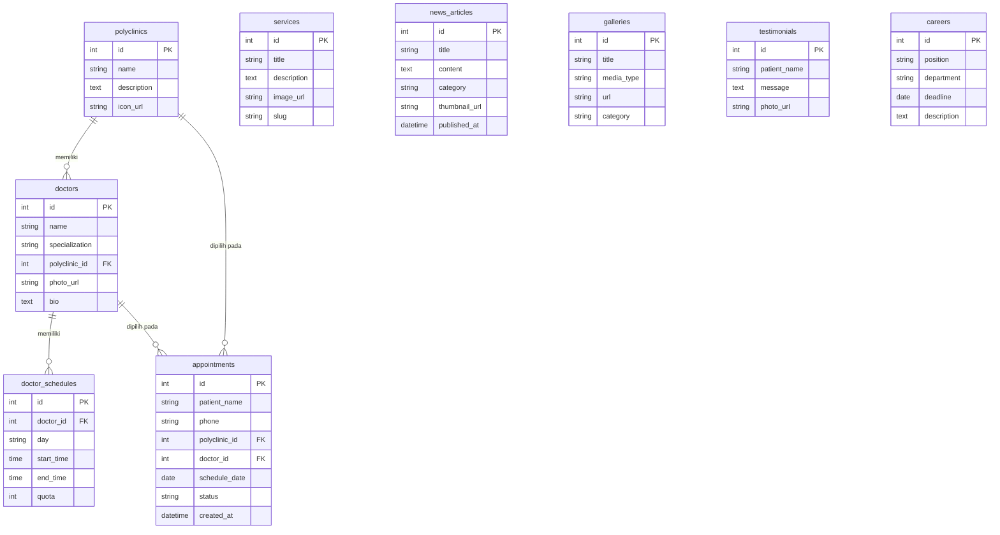

# PRD — Website Profil Rumah Sakit
### (Referensi Gaya & Struktur: RSUP Nasional Dr. Cipto Mangunkusumo — rscm.co.id)

> **Catatan Ketentuan Tugas**
> 1. Total **25 Halaman**
> 2. Terdapat **Galeri** (foto/video)
> 3. **Harmonisasi** desain di seluruh halaman
> 4. **Link/Flow** — alur navigasi antar halaman jelas
> 5. **Database** bersifat **dummy** (data simulasi, bukan integrasi sistem RS yang sesungguhnya)

---

## 1. Overview

Website ini bertujuan untuk mendigitalkan **profil dan informasi publik rumah sakit**, meniru pola informasi dan struktur navigasi yang digunakan oleh RSUP Nasional Dr. Cipto Mangunkusumo (RSCM). Masalah utama yang ingin diselesaikan adalah kurangnya kanal informasi terpusat bagi calon pasien/pengunjung untuk mengetahui profil rumah sakit, layanan medis, jadwal dokter, fasilitas, hingga cara melakukan pendaftaran.

Tujuan utama aplikasi adalah menyediakan **website informasi rumah sakit** yang:
- Menampilkan profil kelembagaan (visi-misi, sejarah, struktur organisasi, akreditasi).
- Menyajikan direktori dokter dan jadwal praktik.
- Menampilkan katalog layanan medis/poliklinik dan fasilitas.
- Menyediakan simulasi pendaftaran/booking janji temu (dummy, tidak terhubung ke sistem rumah sakit nyata).
- Menyajikan galeri, berita/artikel kesehatan, promo, testimoni, dan informasi karier.

## 2. Requirements

- **Aksesibilitas:** Dapat diakses melalui Web Browser, desain **responsif** (desktop, tablet, mobile).
- **Pengguna:**
  - **Pengunjung/Pasien (Publik):** Melihat seluruh informasi, mengisi form pendaftaran/booking dummy, mengisi form kontak.
  - **Admin (Tunggal):** Mengelola konten (dokter, jadwal, berita, galeri, promo, karier) melalui dummy data/seed, tanpa sistem otentikasi kompleks jika di luar cakupan.
- **Jumlah Halaman:** Wajib berjumlah **25 halaman** (lihat Bab 4).
- **Data:** Seluruh data (dokter, jadwal, pasien, berita) berupa **data dummy/mock** — bisa berbentuk JSON lokal atau database yang di-*seed* manual, bukan data pasien sungguhan.
- **Galeri:** Wajib ada halaman Galeri berisi kumpulan foto/video fasilitas dan kegiatan rumah sakit.
- **Harmonisasi:** Seluruh 25 halaman harus konsisten dari sisi warna, tipografi, komponen (header, footer, kartu, tombol), dan tone menyerupai identitas RSCM (bersih, formal, dominan biru-putih).
- **Navigasi/Flow:** Setiap tautan (menu, tombol CTA, kartu) harus terhubung secara logis ke halaman tujuan yang benar — tidak ada *dead link*.

## 3. Core Features

Fitur-fitur kunci yang harus ada dalam versi pertama (MVP), dikelompokkan per modul:

1. **Beranda & Navigasi Utama**
   - Hero section, ringkasan layanan unggulan, promo terbaru, berita terbaru, testimoni.
   - Header (menu utama + akses cepat "Buat Janji") dan Footer (kontak, sitemap, sosial media) yang konsisten di semua halaman.
2. **Profil Kelembagaan**
   - Tentang Rumah Sakit, Visi & Misi, Sejarah, Struktur Organisasi, Akreditasi & Penghargaan.
3. **Layanan Medis**
   - Daftar Layanan Unggulan + halaman detail per layanan.
   - Daftar Poliklinik + halaman detail per poliklinik.
4. **Direktori Dokter**
   - Pencarian/filter dokter berdasarkan spesialisasi & poliklinik.
   - Halaman detail profil dokter (foto, spesialisasi, riwayat pendidikan, jadwal praktik).
5. **Fasilitas & Rawat Inap**
   - Daftar fasilitas rumah sakit (ruang operasi, laboratorium, radiologi, IGD, dll).
   - Informasi kelas/tipe kamar rawat inap beserta estimasi tarif dummy.
6. **Pendaftaran & Informasi Pasien**
   - Form Pendaftaran Online/Booking Janji Temu (dummy — data tersimpan lokal, bukan transaksi nyata).
   - Alur pendaftaran pasien (rawat jalan/rawat inap) dan info metode pembayaran/asuransi (BPJS, asuransi swasta).
7. **Konten Informasi**
   - Galeri foto & video.
   - Berita & Artikel Kesehatan + halaman detail artikel.
   - Promo & Paket Medical Check-Up.
   - Testimoni pasien.
8. **Lain-lain**
   - Karier/Lowongan Kerja, Kontak Kami, FAQ.

## 4. Daftar 25 Halaman

| No | Nama Halaman | Tipe | Keterangan |
|----|--------------|------|------------|
| 1 | Beranda | Statis | Hero, layanan unggulan, promo, berita, testimoni |
| 2 | Profil Rumah Sakit | Statis | Deskripsi umum institusi |
| 3 | Visi, Misi & Nilai | Statis | |
| 4 | Sejarah Rumah Sakit | Statis | Timeline sejarah |
| 5 | Struktur Organisasi | Statis | Bagan direksi/komite medis |
| 6 | Akreditasi & Penghargaan | Statis | Lencana akreditasi, penghargaan |
| 7 | Layanan Unggulan (Daftar) | Statis | Grid/list layanan andalan |
| 8 | Detail Layanan Unggulan | Dinamis (`/layanan/[slug]`) | Deskripsi lengkap 1 layanan |
| 9 | Poliklinik & Layanan Medis (Daftar) | Statis | Grid poliklinik |
| 10 | Detail Poliklinik | Dinamis (`/poliklinik/[slug]`) | Deskripsi poliklinik + dokter terkait |
| 11 | Direktori Dokter (Cari Dokter) | Statis + filter | Pencarian & filter spesialisasi |
| 12 | Detail Profil Dokter | Dinamis (`/dokter/[id]`) | Bio, jadwal praktik |
| 13 | Jadwal Praktik Dokter | Statis | Tabel jadwal seluruh dokter |
| 14 | Fasilitas Rumah Sakit | Statis | Daftar fasilitas medis & penunjang |
| 15 | Kamar Rawat Inap & Tarif | Statis | Tipe kamar + tarif dummy |
| 16 | Pendaftaran Online (Booking) | Form | Form booking janji temu (dummy) |
| 17 | Alur & Informasi Pasien | Statis | Alur rawat jalan/inap |
| 18 | Informasi Asuransi & Pembayaran | Statis | BPJS, asuransi swasta |
| 19 | Galeri | Statis | Grid foto & video |
| 20 | Berita & Artikel Kesehatan (Daftar) | Statis | List berita/artikel |
| 21 | Detail Berita/Artikel | Dinamis (`/berita/[slug]`) | Isi lengkap 1 berita |
| 22 | Promo & Paket Medical Check-Up | Statis | Daftar paket MCU |
| 23 | Testimoni Pasien | Statis | Kumpulan testimoni |
| 24 | Karier / Lowongan Kerja | Statis | Daftar lowongan |
| 25 | Kontak Kami & FAQ | Statis | Form kontak, peta lokasi, FAQ |

> Halaman bertipe **Dinamis** menggunakan satu template yang dirender ulang untuk tiap data (sesuai pola umum aplikasi web modern), sehingga tetap dihitung sebagai 1 dari 25 halaman/route.

## 5. User Flow

Alur utama pengunjung saat menggunakan website:

1. **Kunjungan Awal:** Pengunjung membuka Beranda, melihat layanan unggulan, promo, dan berita terbaru.
2. **Eksplorasi Layanan:** Pengunjung membuka menu "Layanan" → memilih Poliklinik/Layanan Unggulan → membaca detail.
3. **Cari Dokter:** Pengunjung membuka "Cari Dokter" → filter spesialisasi → membuka detail dokter → melihat jadwal praktik.
4. **Pendaftaran:** Dari halaman detail dokter/poliklinik, pengunjung klik "Buat Janji" → mengisi form Pendaftaran Online (nama, poliklinik, dokter, tanggal) → data tersimpan sebagai dummy → sistem menampilkan notifikasi konfirmasi.
5. **Informasi Tambahan:** Pengunjung dapat membuka Galeri, Berita, atau FAQ untuk informasi pendukung.
6. **Kontak:** Jika ada pertanyaan, pengunjung membuka halaman Kontak dan mengisi form pengaduan/pertanyaan.

## 6. Alur Navigasi Website (Link Flow)

Diagram berikut menggambarkan keterhubungan antar halaman (sitemap navigasi), memastikan tidak ada tautan yang buntu:

Setiap tautan pada **Header** (menu utama) dan **Footer** (sitemap ringkas) mengarah ke 25 halaman di atas tanpa terkecuali, sehingga seluruh halaman dapat dijangkau maksimal 2 klik dari Beranda.

## 7. Architecture

Contoh alur teknis untuk proses **Pendaftaran Online (dummy)**:

## 8. Database Schema (Dummy)

Seluruh tabel berikut berisi **data simulasi/seed**, bukan data pasien sungguhan:

| Tabel | Deskripsi |
|-------|-----------|
| **doctors** | Master data dokter (dummy), terhubung ke poliklinik |
| **polyclinics** | Master data poliklinik/layanan medis |
| **doctor_schedules** | Jadwal praktik dummy per dokter |
| **services** | Layanan unggulan yang ditampilkan di Beranda |
| **appointments** | Simulasi data booking/pendaftaran pengunjung |
| **news_articles** | Berita & artikel kesehatan |
| **galleries** | Data foto/video untuk halaman Galeri |
| **testimonials** | Testimoni pasien |
| **careers** | Data lowongan kerja |

## 9. Desain & Harmonisasi Visual

Agar 25 halaman terasa sebagai satu kesatuan (harmonis), seluruh halaman **wajib** memakai design system yang sama:

- **Komponen Konsisten:** Header, Footer, Card layanan/dokter/berita, Button CTA ("Buat Janji"), dan Breadcrumb digunakan ulang (reusable) di semua halaman terkait — tidak dibuat ulang per halaman.
- **Palet Warna** (terinspirasi identitas rumah sakit seperti RSCM — kesan bersih, profesional, terpercaya):
  - Primary: Biru institusi (`#0B5FA5` atau sejenis) — header, tombol utama, aksen.
  - Secondary/Accent: Hijau kesehatan (`#1FA971`) — untuk status/notifikasi positif.
  - Netral: Putih (`#FFFFFF`) & abu-abu (`#F5F6F8`, `#4B5563`) — latar & teks.
- **Tipografi:**
  - **Sans (utama):** `Inter, ui-sans-serif, system-ui`
  - **Mono (kode/label teknis jika perlu):** `JetBrains Mono, monospace`
- **Grid & Spacing:** Gunakan skala spacing konsisten (misal kelipatan 4px/8px) dan lebar kontainer maksimum yang sama di seluruh halaman.
- **Nada Konten (Tone):** Formal, informatif, menenangkan — hindari bahasa promosi berlebihan, sesuai citra institusi kesehatan.

## 10. Rencana Progres Mingguan

Pengerjaan disusun bertahap dari yang paling sederhana ke yang paling kompleks:

| Minggu | Fokus Pengerjaan |
|--------|-------------------|
| 1 | Riset acuan (RSCM), menyusun PRD ini, menentukan 25 halaman & wireframe kasar |
| 2 | Menyusun design system (warna, tipografi, komponen) untuk harmonisasi visual |
| 3 | Setup project, membuat skema database dummy, mengisi data seed awal |
| 4 | Membangun Header, Footer, dan halaman Beranda |
| 5 | Halaman Profil RS: Profil, Visi & Misi, Sejarah, Struktur Organisasi, Akreditasi |
| 6 | Modul Layanan Medis: Layanan Unggulan (daftar + detail), Poliklinik (daftar + detail) |
| 7 | Modul Dokter: Direktori Dokter, Detail Dokter, Jadwal Praktik |
| 8 | Modul Fasilitas: Fasilitas RS, Kamar Rawat Inap & Tarif |
| 9 | Modul Pendaftaran: Form Booking dummy, Alur & Info Pasien, Info Asuransi |
| 10 | Konten Informasi: Galeri, Berita & Artikel (daftar + detail), Promo & MCU |
| 11 | Halaman pelengkap: Testimoni, Karier, Kontak & FAQ — sekaligus audit harmonisasi seluruh halaman |
| 12 | Pengujian alur navigasi (cek semua link/flow), perbaikan bug, dan finalisasi dokumentasi |

## 11. Design & Technical Constraints

1. **High-Level Technology:**
   Sistem bebas dibangun menggunakan teknologi modern yang mendukung pengembangan cepat dan mudah dipelihara. Tidak terikat stack spesifik, namun untuk 25 halaman dengan beberapa halaman dinamis (detail dokter, poliklinik, berita, layanan), disarankan menggunakan framework berbasis komponen dengan routing bawaan (misalnya Next.js/React) agar Header/Footer/komponen kartu dapat dipakai ulang dengan mudah — sejalan dengan kebutuhan harmonisasi di Bab 9.

2. **Data Dummy:**
   Data dapat disimpan sebagai file JSON lokal, atau database ringan (mis. SQLite) yang di-*seed* manual sesuai skema Bab 8 — tidak diwajibkan terhubung ke sistem informasi rumah sakit sungguhan.

3. **Typography Rules:**
   Sistem antarmuka (UI) menggunakan konfigurasi font berikut untuk menjaga konsistensi visual di seluruh 25 halaman:
   - **Sans:** `Inter, ui-sans-serif, system-ui`
   - **Serif:** `serif` (dipakai terbatas, misal kutipan testimoni)
   - **Mono:** `JetBrains Mono, monospace`
